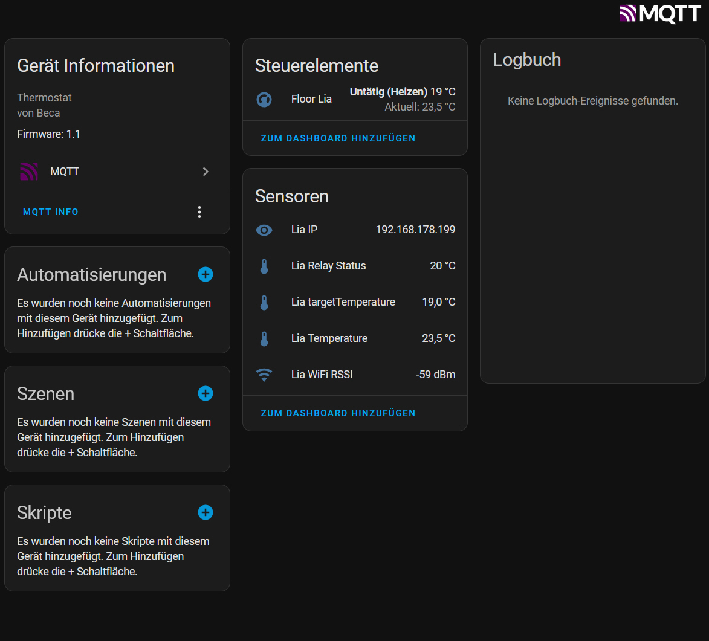

# WThermostat - Fork

FAS  <https://github.com/fashberg/WThermostatBeca> forked

from <https://github.com/klausahrenberg/WThermostatBeca> with some new features.

.

I have also added some features to fit into my Home Assistant environment.

.

Additional features (compared to FAS):
  * MQTT discovery updated to match Home Assistant requirements
  * you can connect a Sensirion SHT31 "Temp & Humidty" Sensor to get additional high accuracy Temp & Humidity information
    * D5 = SCL_Pin
    * D6 = SDA Pin
  * Dewpoint is calculated with SHT31 information
  * Additional Sensors are automatically created in Home assistant to show separately:
    * IP adress
    * Current Temperature
    * Target Temperature
    * Relay Status (as a temperature, so you can put all into the same HA "History Graph")

